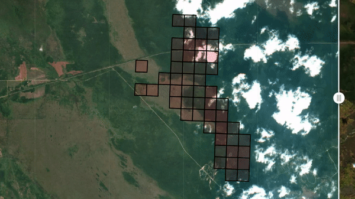
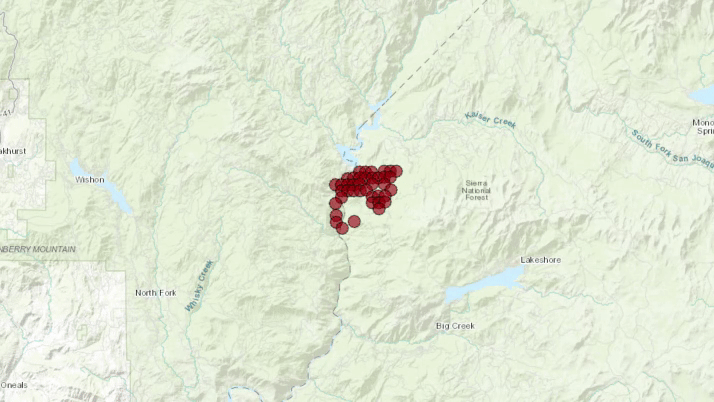

# Global fire spread prediction system

## About the project

I used the knowledge of wildfires, satellite data, and machine learning to create a system that predicts how fires will spread. Satellites can see large areas quickly and reach even remote places. Knowing where a fire will go next could be crucial for disaster response efforts, like protecting towns or buildings in danger. 
The system uses information from MODIS and VIIRS satellites, which have been collecting data from various parts of the light spectrum for a long time, along with elevation and land cover data. The models were better at predicting fire patterns for the next day than a simpler model that just assumed the fire would stay the same size. They also showed how these predictions could be used in a helpful application for fire managers. 

## Dataset preparation
Data sources are mostly from the [Registry of Open Data on AWS](https://registry.opendata.aws/), apart from the NASA-FIRMS open data which requires an account to access the data:

| Data source                                                        | Description                                                                                                                                                                                                                                                            |
|--------------------------------------------------------------------|------------------------------------------------------------------------------------------------------------------------------------------------------------------------------------------------------------------------------------------------------------------------|
| [Copernicus DEM](https://registry.opendata.aws/copernicus-dem/)    | This provides high-resolution elevation data, potentially used to identify areas with higher fire risk (e.g., steeper slopes) or to adjust fire spread models based on terrain.                                                                                                                                             |
| [MODIS](https://registry.opendata.aws/modis/)                      | This offers daily information on land surface reflectance, which could be helpful in characterizing vegetation type and moisture content, both of which are crucial factors in fire risk assessment. |
| [ESA Land Cover](https://registry.opendata.aws/esa-worldcover/)    | The European Space Agency (ESA) WorldCover is a high-resolution land cover data can help identify areas with different fuel types (e.g., forests, grasslands) which influence fire behavior.                                              |
| [ERA5 Atmospheric data](https://registry.opendata.aws/ecmwf-era5/) | his dataset provides atmospheric information like temperature, humidity, and wind speed, which are critical factors influencing fire spread and intensity.                                                          |
| [FIRMS active fire data](https://firms.modaps.eosdis.nasa.gov/) | The Fire Information for Resource Management System (FIRMS) is the core fire detection data, providing near real-time information on active fire locations. |

The processing code is in the folder `dataset_preparation`. 

## Data quality
Data quality checks involve visualising examples of the dataset and generating descriptive statistics about each variables of dataset, such as mean and standard deviation so that the data can be normalised when required by the mode. Additionally this process should identify any anomlies or outliers in the dataset, which may require special attention. The readme in the `data_quality` folder provides further information. These checks were important since they identified that some features contained essentially the same information (e.g. NDVI & the landcore index) and allowed us to identify which features had the best overall data quality. An example single sample of data is shown below: note that not all features were used in the final model training.

## Classical ML
Following the approach presented in the paper [Next Day Wildfire Spread: A Machine Learning Data Set to Predict Wildfire Spreading from Remote-Sensing Data](https://arxiv.org/abs/2112.02447) both logistic regression and random forest models were trained on flattened 3x3 pixel patches of imagery. This required transforming the dataset of images to a table of data in csv format, shown in the notebook `/classical_ml/create_csv.ipynb`. The processing for doing this transformation is in the notebook `classical_ml/create_csv.ipynb`. To avoid needing to copy image data locally and to conserve storage on the sagemaker instance, pixel data was accessed as numpy arrays that are hosted on [AWS S3](https://aws.amazon.com/s3/). To speed up processing [multiprocessing](https://docs.python.org/3/library/multiprocessing.html) was used, allowing all 4 cores of the sagemaker instance to be used.

The logistic regression model struggled to beat the naive baseline assumption that fires are persistent over time, whilst the random forest model achieved a significant improvement over the baseline (table below). Note that the training dataset is very imbalanced with the significant majority of pixels being `not-fire`, but we want a model with good performance on the `fire` pixels. To deal with this imbalance the `class_weight` parameter was experimented, as well as the `max_depth` of the trees. The precision and recall of the best performing model (selected for improving both these metrics over the baseline) are in the table below.

| Fire weight  | max_depth   | fire precision  | fire recall | no-fire precision  | no-fire recall |
| -----------  | ----------- | -----------     | ----------- | -----------        |    ----------- |
| Baseline     | NA          |      0.37       |    0.37     |      0.98          |     0.98       |
| 4            | 10          |      0.41       |    0.41     |      0.98          |     0.98       |

Inspection of feature importance identified the current fire location as the most significant indicator of fire spread, followed by elevation and landcover features.

## Deep learning with ResUNet
Amongst several CNN model architectures tested, we selected the [ResUNet](https://arxiv.org/abs/1711.10684) as it is showed the best performance during preliminary experiments. The ResUNet performance is compared to the baseline (fire persistence).

The model achieves better precision and recall for the fire class than the baseline.

Future work could include: class balancing support & version of dice coefficient compatible with class balancing, and use of AutoML pipelines to improve efficiency of model architecture and hyperparameters tests

## Fire predictions visualisation
Visualisation tools were created for demonstrating how model predictions can be used in applications.

**Fire prediction mapping on Sentinel-2 layer:** This map tool is created for visualising VIIRS fire raw data/ ML model training results being generated. We use the geojson/metadata created from pre-processing to locate the fire pixels from ML model training results. Finally, those fire pixels are plotted overlapping with the Sentinel-2 data. The tool is in notebook `fire_prediction_visualisation/split_map_s2_fire.ipynb`

**Fire prediction mapping on top of open street map:** To make sure the predicted fire information can be easily used for fire management, we created a fire warning system with an example below. You can zoom in/out to check the exactly location of fire episodes. This system will also get nearby building data from open street map and generate a warning at individual building/power station ect level for any within 10km of fire. The tool is in notebook `fire_prediction_visualisation/animation_fire_warning_using_open_street_map.ipynb` and exported to `fire_prediction_visualisation/fire_warning.html` (open in browser)

### Running notebooks
All notebooks in this repo are runnable on AWS Sagemaker Studio Lab. For the python environmnet, some people used custom environments defined using an `env.yml` file, whilst other people just installed packages into one of the supplied environments using a `requirements.txt` file.

### Languages, frameworks, platforms, APIs, & other technologies used
- Python 3 used for processing, modelling and visualisation
- Scikit learn for classical ML modelling & Yellowbrick for feature importance visualisation
- Deep learning used Keras/tensorflow
- AWS Studio Lab used for running notebooks and training ML models
- AWS S3 used for data storage
- https://firms.modaps.eosdis.nasa.gov/ for VIIRS fire data
- https://earth-search.aws.element84.com/v0/collections/sentinel-s2-l2a-cogs for Sentinel 2 images
- https://eod-catalog-svc-prod.astraea.earth/ for MODIS data
- https://registry.opendata.aws/ Registry of Open Data on AWS for all other data
- [Open Street Map API](https://www.openstreetmap.org/) (via osmnx)
- Git & github used for version control of code
- [Weights & Biases](https://wandb.ai/site) was used for tracking training metrics of the deep learning model
- [ipyleaflet](https://ipyleaflet.readthedocs.io/en/latest/) was used to create interactive maps in Jupyter notebooks
- [Zarr](https://zarr.readthedocs.io/en/stable/) is a format for the storage of chunked, compressed, N-dimensional arrays

