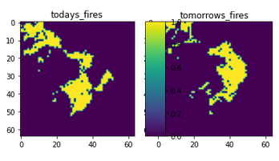
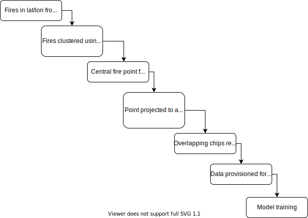

## Dataset preparation
This folder contains the code for generating a dataset for training a fire prediction model. 

Data sources are all from [Registry of Open Data on AWS](https://registry.opendata.aws/), apart from the fire data which requires an account to access:

| Data source                                                        | Description                                                                                                                                                                                                                                                            |
|--------------------------------------------------------------------|------------------------------------------------------------------------------------------------------------------------------------------------------------------------------------------------------------------------------------------------------------------------|
| [Copernicus DEM](https://registry.opendata.aws/copernicus-dem/)    | This provides high-resolution elevation data, potentially used to identify areas with higher fire risk (e.g., steeper slopes) or to adjust fire spread models based on terrain.                                                                                                                                             |
| [MODIS](https://registry.opendata.aws/modis/)                      | This offers daily information on land surface reflectance, which could be helpful in characterizing vegetation type and moisture content, both of which are crucial factors in fire risk assessment. |
| [ESA Land Cover](https://registry.opendata.aws/esa-worldcover/)    | The European Space Agency (ESA) WorldCover is a high-resolution land cover data can help identify areas with different fuel types (e.g., forests, grasslands) which influence fire behavior.                                              |
| [ERA5 Atmospheric data](https://registry.opendata.aws/ecmwf-era5/) | his dataset provides atmospheric information like temperature, humidity, and wind speed, which are critical factors influencing fire spread and intensity.                                                          |
| [FIRMS active fire data](https://firms.modaps.eosdis.nasa.gov/) | The Fire Information for Resource Management System (FIRMS) is the core fire detection data, providing near real-time information on active fire locations. |

### Fire masks
Fire masks represent areas which are actively on fire on a given day. These masks are provided by the VIIRS sensor, with active (and historical) fire hotspot data made available through a [web portal](https://firms.modaps.eosdis.nasa.gov/). Instead of generating a chip for every hotspot, I clustered the fire points and dropped any clusters with less than 25 fire points within a 24 hour period. Then for each remaining cluster - I find the central fire point and create the chip boundary around it. 

For each chip we process the output for the active fires for 2 concurrent days:

### Atmospheric data
The atmospheric data we are using is all available on s3 in [zarr](https://zarr.readthedocs.io/en/stable/) format. It is publicly available with information about the bucket listed [here](https://registry.opendata.aws/ecmwf-era5/). For these data, for a given chip, I created a connection to the appropriate zarr file and resample to the appropriate coordinate reference system, pixel size and time (1 day) to the bounds for the given day. These data are then written to disk.

## Landcover data 
For landcover, I used ESA worldcover data, available on s3 [here](https://registry.opendata.aws/esa-worldcover/). I reprojected these data directly to the appropriate CRS for each chip using [Rasterio](https://rasterio.readthedocs.io/en/latest/)

## Elevation data
For elevation, we use ESA worldcover data, available on s3 [here](https://registry.opendata.aws/copernicus-dem/). I reprojected these data directly to the appropriate CRS for each chip using Rasterio

## MODIS data
I query MODIS data using [astrea’s STAC](https://eod-catalog-svc-prod.astraea.earth/). The data on the STAC is in requester-pays bucket, so in order to avoid charges I updated the links in the response to point to the free bucket, which will be slightly slower as the data are not in COGs. The NDVI is then processed thereafter using rasterio:

## Processing workflow
The workflow is represented below:

In total, 15436 chips with no spatio-temporal overlap were generated for training. Each feature is represented as a 64x64 pixel image, where each pixel is 500m on the Earth. For each fire, images for all features were placed in a single 'folder' on S3, with data stored in numpy (`.npy`) files.
